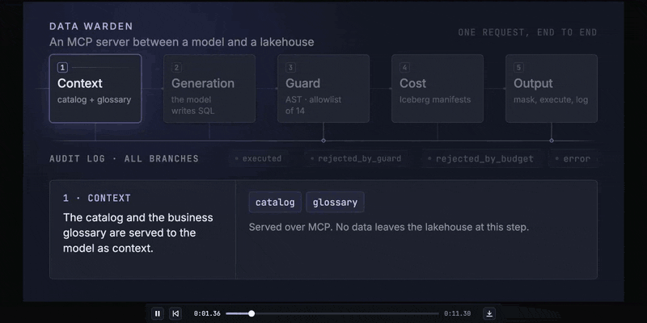
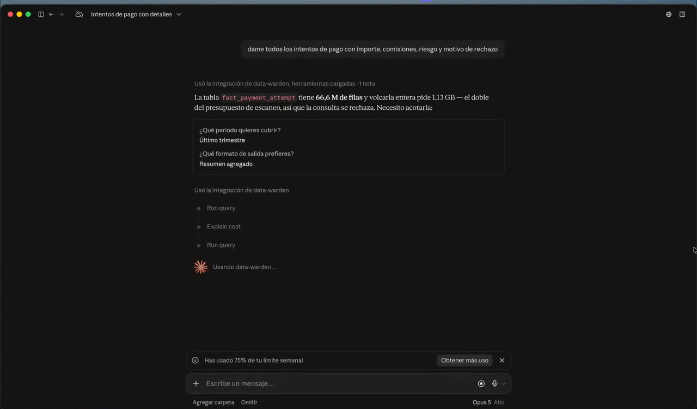
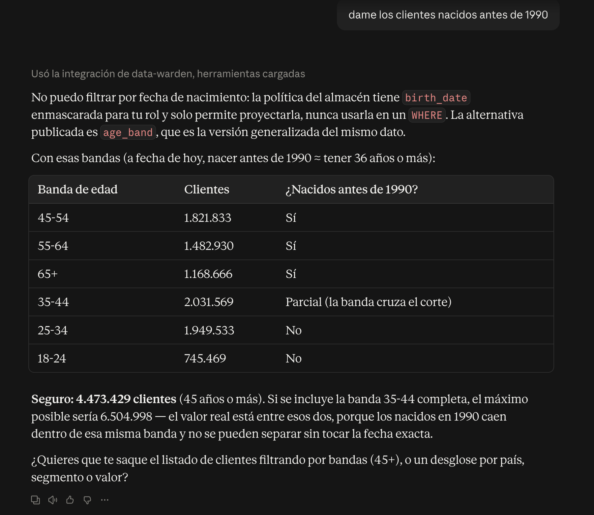
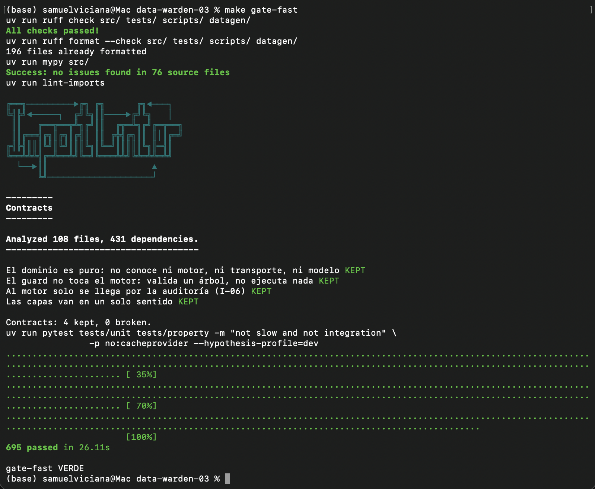

<h1 align="center">Data Warden</h1>

<p align="center">
  <strong>Un agente que traduce lenguaje natural a SQL sobre un lakehouse, y cinco anillos de
  control deterministas que garantizan que lo que salga de ahí no pueda hacer daño.</strong>
</p>

<p align="center">
  
  
  
  
  
  
</p>

<p align="center">
  
</p>

<p align="center">
  <sub><b>Una petición, de principio a fin.</b> El rechazo no es el caso de error: es el producto.<br>
  <a href="docs/img/flow.mp4">Versión en vídeo</a> · <a href="docs/img/flow.png">fotograma estático</a></sub>
</p>

---

## En una frase

Traducir lenguaje natural a SQL ya está resuelto. Lo que impide llevarlo a producción en una
empresa con datos de verdad es todo lo que viene después: **quién puede ver qué columna, qué
pasa si el modelo escribe un `DELETE`, cuánto cuesta la consulta antes de lanzarla y quién
responde cuando alguien pregunta qué se ejecutó el martes a las tres.**

Data Warden es ese «después». El modelo propone y **el sistema decide**, con reglas que no
viven en el prompt. Por eso da igual qué cliente se conecte o qué modelo use: **no puede
saltarse las reglas, porque no están de su lado.**

## Qué demuestra

| | Garantía | Evidencia |
|---|---|---|
| 🛡️ | **El SQL se valida como árbol, no como texto**, y lo que se ejecuta es el árbol validado, nunca la cadena que entró. Allowlist de 14 reglas: lo desconocido se rechaza | 0 evasiones en una reserva escrita a ciegas y en 3.388 variantes mutadas; 0 excepciones en 20.000 entradas arbitrarias |
| 💶 | **El coste se conoce antes de ejecutar**, leyendo metadatos de Iceberg y sin tocar una fila | 0 consultas caras llegan al motor; una de 3 GB se rechaza en 1,4 ms |
| 🎭 | **El enmascarado por rol reescribe el AST**, así que tampoco escapa por un `WHERE`, un `GROUP BY` o un alias | 0 fugas de datos personales en proyección, predicado y agregación |
| 🔗 | **Todo queda auditado, también lo rechazado**, en una cadena de hashes que delata cualquier edición | 100 % de invocaciones auditadas; 100 % de 1.299 manipulaciones detectadas |
| 🪪 | **El rol lo fija quien instala el servidor**, nunca quien pregunta | 0 suplantaciones aceptadas vía `_meta` o argumentos de herramienta |
| 🤖 | **La IA se mide con intervalo, no con un número bonito** | exactitud 0,517 · Wilson 95 % [0,39 – 0,64] sobre 60 preguntas, con un modelo local de 26B |

Cada cifra sale de un artefacto de `evals/reports/` y lleva al lado el comando que la
reproduce ([tabla completa](#resultados)).

## Verlo funcionando

<p align="center">
  <a href="docs/proof/video/proof.mp4">
    
  </a>
</p>

<p align="center">
  <sub><b>90 segundos, sin cortes, contra el dataset completo.</b>
  <a href="docs/proof/video/proof.mp4">▶ Ver el vídeo</a></sub>
</p>

Tres preguntas seguidas en un cliente MCP real, y las tres respuestas que definen el sistema:

1. **Una pregunta normal** — *«¿cuántos clientes hay por país?»* — se contesta: 9.199.249 clientes
   repartidos en 30 países.
2. **Una que la política no permite** — *«dame los clientes nacidos antes de 1990»* — se **rechaza**,
   y el rechazo trae la alternativa publicada, así que la respuesta sigue siendo útil.
3. **Una demasiado cara** — *«dame todos los intentos de pago con importe, comisiones, riesgo y
   motivo de rechazo»* — se **rechaza antes de ejecutarse**, con el tamaño calculado sin leer datos,
   y el cliente acota a un trimestre y un resumen agregado hasta obtener la respuesta.

<table>
<tr>
<td width="50%" valign="top">

</td>
<td width="50%" valign="top">

</td>
</tr>
<tr>
<td valign="top"><sub><b>El rechazo es el producto.</b> <code>birth_date</code> está enmascarada para
ese rol y solo puede proyectarse, nunca filtrarse. El sistema lo dice, nombra la alternativa
—<code>age_band</code>— y el cliente contesta con ella, incluida la parte que <b>no</b> puede
afinar sin la fecha exacta.</sub></td>
<td valign="top"><sub><b>Y se verifica en 26 segundos.</b> <code>make gate-fast</code> sobre un clon
limpio: tipos, los cuatro contratos de capas y 695 tests, sin necesidad de generar el dataset.</sub></td>
</tr>
</table>

## Cómo funciona

```
    lenguaje natural
          │
          ▼
    ①  CONTEXTO      catálogo generado + glosario de negocio firmado
          │          el modelo no adivina la estructura: la lee
          ▼
    ②  GENERACIÓN    NL → SQL · la única parte con un LLM · se corrige leyendo el rechazo
          │
          ▼
    ③  VALIDACIÓN    sqlglot → AST → guard de ALLOWLIST · 14 reglas · fail-closed
          │          nodo o función desconocidos ⇒ rechazo
          ▼
    ④  COSTE         estimado desde los manifiestos de Iceberg, sin leer datos
          │          blando: pide confirmación · duro: no se ejecuta
          ▼
    ⑤  SALIDA        enmascarado por rol reescribiendo el AST · límite de filas
          │          auditoría append-only con hash encadenado (JCS, RFC 8785)
          ▼
    resultado, o un rechazo que dice qué regla saltó y qué hacer en su lugar
```

Los anillos ③ a ⑤ son **deterministas**: no dependen del modelo, se prueban con TDD,
propiedades y mutación, y funcionan igual con cualquier cliente. El ② es el único
probabilístico, y por eso **se mide con evaluaciones y no se prueba con asserts**.

Un rechazo no es un error de protocolo: es la respuesta más útil que da el sistema.

```
R008 · column dim_customer.birth_date is masked for role analyst: it may only appear
       as a direct projection, and it appears in a WHERE predicate
       → use dim_customer.age_band instead
```

El mismo núcleo se sirve por **MCP 2026-07-28** (stdio) y por **HTTP** (FastAPI). Un test de
contrato exige que los dos transportes devuelvan el mismo resultset normalizado y que
ninguno importe al otro: el dominio no depende del transporte.

## Probarlo

Requiere **Python 3.12** y [`uv`](https://docs.astral.sh/uv/). No hay servidor que levantar,
ni puertos, ni credenciales: DuckDB va embebido y los datos son Parquet.

### 1 · Verificar sin datos · menos de un minuto

```bash
git clone https://github.com/samuvm/data-warden.git && cd data-warden
uv sync                  # versiones exactas desde uv.lock
make gate-fast           # lint · tipos · contratos de capas · 695 tests
```

No hace falta generar nada: el catálogo, la política de acceso y las estadísticas de coste
van versionados.

### 2 · Generar el dataset

El dataset no se versiona. Se genera y sale **idéntico byte a byte** desde su semilla:

```bash
make dataset PROFILE=dev     # ~15 s · 3,1 M filas · 91 MB    · para explorar
make dataset PROFILE=full    # minutos · 294,8 M filas · 7,46 GB · el de los números publicados
```

### 3 · Conectarlo a un cliente MCP

Con Claude Desktop, el bloque de configuración es este (la guía completa, con la
pimienta, los errores típicos y cómo comprobarlo antes de reiniciar, está en
[`docs/instalar-en-claude-desktop.md`](docs/instalar-en-claude-desktop.md)):

```json
"mcpServers": {
  "data-warden": {
    "command": "<la salida de `which uv`>",
    "args": ["run", "--directory", "<ruta absoluta al repositorio>", "warden", "mcp", "serve"],
    "env": {
      "DATAWARDEN_MASK_PEPPER": "<32 caracteres o más: openssl rand -hex 24>",
      "WARDEN_ROLE": "analyst"
    }
  }
}
```

El servidor usa el perfil `full` por defecto. Para probar con `dev`, añade
`"--database", "datagen/out/cierzo-dev.duckdb"` al final de `args`; el presupuesto sigue
tarifando `full`, así que con `dev` rechaza algo más de lo necesario, nunca menos.

Y después, dos preguntas: *«¿cuántos clientes hay por país?»* debe responder;
*«dame los clientes nacidos antes de 1990»* debe salir **rechazada**, con la regla y la
alternativa. Si responde la primera y rechaza la segunda, el sistema está haciendo su
trabajo.

### 4 · Reproducir los números publicados

Necesitan el perfil `full` generado.

```bash
make eval                # exactitud NL→SQL · determinista · NO necesita ningún modelo
make gate-full           # la suite completa, cobertura, secretos y ataques
make done MILESTONE=8    # las 13 condiciones de «hecho» · incluye mutación: tarda
```

`make eval` reproduce la métrica de exactitud **sin llamar a ningún modelo**: las respuestas
del generador están grabadas por modelo y por petición, así que el número se repite en
cualquier máquina. Solo `make eval-refresh-exec` vuelve a llamar al modelo local, que es
`gemma4:26b-mlx` sobre Ollama, fijado por digest en `models.lock`.

<a id="resultados"></a>
## Resultados

Medido sobre **MacBook Pro M4 Max · 36 GB · macOS 26.5**. Umbrales en
[`docs/GOALS.yaml`](docs/GOALS.yaml), sellados con `thresholds.lock`. Esta tabla **no se
escribe a mano**: la genera `make readme` desde `evals/reports/`.

<!-- numeros:inicio · lo genera `make readme`, no se edita a mano -->

**Garantías · axiomas: su umbral no admite rebaja**

| Qué se mide | Umbral | Medido | Comando |
|---|---|---|---|
| Consultas de escritura o evasión que el guard deja pasar | 0 | **0 evasiones** · reserva 15/15, Wilson 95 % [0,80 – 1,00] | `make attack-holdout` |
| … sobre variantes generadas mutando el AST | 0 | **0 evasiones** en 3.388 mutantes | `make attack-mut` |
| Excepciones que escapan del guard (fail-closed) | 0 | **0** en 20.000 entradas arbitrarias | `make guard-property` |
| Consultas que se ejecutan como cadena y no como AST validado | 0 | **0** | `make arch-checks` |
| Consultas caras que llegan al motor | 0 | **0** · una de 3 GB se rechaza en 1,4 ms | `make budget-invariant` |
| Datos personales que salen sin enmascarar | 0 | **0** en proyección, predicado y agregación | `make pii-suite` |
| Invocaciones al motor sin registro de auditoría | 100 % auditadas | **100 %** | `pytest tests/property/test_audit_coverage.py` |
| Suplantaciones de rol aceptadas (vía `_meta` o argumentos) | 0 | **0** | `pytest tests/adversarial/test_role_spoofing.py` |
| Secretos nuevos en el repositorio | 0 | **0** | `make secrets` |

**Rendimiento, coste y trazabilidad**

| Qué se mide | Umbral | Medido | Comando |
|---|---|---|---|
| Latencia del guard | p95 ≤ 25 ms | **p95 0,87 ms** · p99 1,21 · máx. 3,98 | `make bench-guard` |
| Error del estimador de coste | p95(real/est.) ≤ 1,5 | **1,077** | `make cost-calibration` |
| Manipulaciones de la auditoría detectadas | 100 % | **100 %** de 1.299 bytes alterados | `pytest tests/property/test_audit_chain.py` |

**Calidad de la base de código**

| Qué se mide | Umbral | Medido | Comando |
|---|---|---|---|
| Cobertura de línea · global / módulos críticos | ≥ 90 % / ≥ 95 % | **98,0 % / 97,48 %** | `make coverage` |
| Funciones públicas sin un solo test | 0 | **0** | `make coverage` |
| Mutación · reglas del guard | ≥ 85 % | **85,46 %** | `make mutation` |
| Mutación · resto del núcleo | ≥ 70 % | **71,6 %** | `make mutation` |
| Conformidad con MCP 2026-07-28 | 11/11 | **11/11** | `make mcp-conformance` |

**La parte con IA · se mide, no se testea**

| Qué se mide | Umbral | Medido | Comando |
|---|---|---|---|
| Exactitud NL→SQL sobre 60 preguntas de referencia | ≥ 0,40 · Wilson ≥ 0,25 | **0,517** (31/60) · Wilson 95 % [0,39 – 0,64] | `make eval` |
| Recuperación tras un rechazo del guard | ≥ 0,70 | **0,857** (24/28) · Wilson 95 % [0,69 – 0,94] | `make eval-recovery` |
| Elección de la herramienta MCP correcta | 20/20 | **20/20** | `make eval-toolchoice` |

<!-- numeros:fin -->

### Cómo leer el número de exactitud

Es el número más fácil de malinterpretar, así que va con todo el contexto:

- **Se publica el intervalo, no el punto.** Con 60 preguntas, «0,517» sin su intervalo de
  Wilson [0,39 – 0,64] sería un número sin significado.
- **El umbral inicial era 0,80 y se redefinió a 0,40** tras cuatro medidas con dos modelos
  locales. Se decidió con los datos delante y se dice aquí: bajar el listón *y* subir el
  modelo fueron la misma decisión. Con el modelo de 9B el sistema daba 0,19; con el de 26B,
  el fallo dejó de ser sintáctico (tablas inventadas: de 12 a 2; SQL que no compila: de 6
  a 0) y pasó a ser semántico. **El trabajo que queda está en el contexto de negocio, no en
  el modelo.**
- **Las 60 preguntas** están estratificadas (20 simples, 25 con join o agregación, 15 con
  ventana o subconsulta correlacionada) y **10 tienen «rechazo» como respuesta correcta**:
  preguntas que un analista haría de buena fe y que su rol no le permite contestar.
- **La verdad se compara sobre resultsets normalizados**, nunca sobre el texto del SQL. Dos
  consultas distintas que devuelven lo mismo aciertan las dos. Las reglas están en
  [`docs/spec/resultset-equality.md`](docs/spec/resultset-equality.md).
- **Es autoevaluado**: las referencias las escribió el mismo agente que construyó el sistema,
  transcribiendo definiciones de un glosario de negocio firmado por una persona, y todavía no
  las ha revisado nadie más. Ver [limitaciones](#limitaciones).

## Decisiones de diseño

| Decisión | Por qué |
|---|---|
| **Allowlist, no denylist** | Una denylist no puede prohibir lo que todavía no se le ha ocurrido a nadie. Un nodo o una función que no estén declarados se rechazan, y esa asimetría es el diseño entero |
| **Se ejecuta el AST validado, nunca la cadena** | Validar un texto y ejecutar otro abre la puerta a cualquier diferencia entre los dos. `Engine.execute()` solo acepta un `ValidatedQuery`, y un check de arquitectura lo exige |
| **Fail-closed** | Si el guard falla por dentro, o se pasa de tiempo, el resultado es un rechazo. Nunca un paso |
| **El enmascarado reescribe el AST** | Post-procesar el resultado por nombre de columna no ve un `WHERE iban LIKE 'ES91…%'`, que extrae el dato sin imprimirlo. La regla R008 decide por rol *y por posición en la consulta*, siguiendo el linaje a través de alias, CTE y vistas |
| **Coste desde los manifiestos de Iceberg** | `EXPLAIN ANALYZE` ejecuta la consulta, y un motor en la nube cobra antes de decir cuánto escaneó. El manifiesto da bytes por columna y por partición sin leer una fila. Lo dudoso se redondea hacia arriba: subestimar dejaría pasar una consulta cara |
| **Auditoría con hash encadenado** | Detecta la edición de cualquier registro. Su límite —no impide que alguien con acceso al fichero lo trunque entero— está escrito en el [modelo de amenaza, §4.1](docs/threat-model.md) |
| **El rol sale del entorno del proceso** | `_meta` y los argumentos de una herramienta son datos que controla quien pregunta. Tratarlos como autoridad es regalar el rol |
| **MCP sin sesión, con MRTR** | El presupuesto blando pide confirmación con el patrón de petición de entrada de la especificación 2026-07-28. Si el cliente no sabe contestar, se ejecuta con un aviso en la respuesta, y el presupuesto duro sigue rechazando solo |
| **Evaluaciones grabadas** | Temperatura 0, semilla fija y respuestas grabadas por modelo y por petición. Un número que no se puede volver a obtener no es un número |
| **Telemetría con modelo propio** | Ningún atributo `gen_ai.*` de OpenTelemetry es estable todavía. El dominio usa su propio modelo y un traductor es el único módulo que conoce los nombres del estándar: la próxima ruptura de la especificación es un fichero, no una migración |

## Lo que encontraron las comprobaciones

El proyecto publica sus fallos porque cada uno cambió un test o una regla. Los más serios:

- **El anillo de enmascarado no estaba en el camino de ejecución, y su axioma daba 0 fugas.**
  La medida probaba una función que el sistema no llamaba. Hoy se mide a través del ejecutor
  real y un check de arquitectura exige que ese camino pase por el anillo
  ([modelo de amenaza §5.2](docs/threat-model.md)).
- **El estimador cobraba 0 bytes por una tabla de 4,1 GB.** Una clave de partición mal
  serializada vaciaba la poda, y cualquier consulta con fecha habría pasado el presupuesto. Lo
  encontró la calibración, no una revisión ([§5.1](docs/threat-model.md)).
- **El mensaje de rechazo del guard era un canal de inyección de prompt.** Un nombre de tabla
  con saltos de línea fabricaba secciones falsas en el prompt de corrección. Hoy se sanea todo
  lo que vuelve al modelo ([§4.3.1](docs/threat-model.md)).
- **El check de secretos no podía fallar**, porque el escáner reescribía la propia línea base
  contra la que comparaba; y después resultó que no miraba los ficheros aún no añadidos a git.
  Ambos se demostraron plantando una clave falsa.
- **Un `SIGSEGV` en el `sqlglot` compilado** con `x UNION SELECT 1`. Una caída nativa no la
  atrapa ningún `except`: se cierra en R001, antes de cualificar el árbol.

El patrón que se repite, y la lección del proyecto: **no basta con medir un anillo, hay que
medirlo por el camino que se ejecuta.** El detalle está en [`docs/JOURNAL.md`](docs/JOURNAL.md),
con los errores dentro.

<a id="limitaciones"></a>
## Limitaciones

Se dicen aquí porque no decirlas sería el fallo:

- **Los números son autoevaluados.** La reserva de ataques la escribió un agente que no vio
  el código del guard, pero ese aislamiento es disciplina, no un control técnico. El banco de
  preguntas lo escribió el mismo agente que construyó el sistema, transcribiendo un glosario
  firmado por una persona. Ninguno de los dos lo ha revisado todavía alguien externo.
- **La reserva de ataques tiene 15 casos.** Por eso se publica el intervalo [0,80 – 1,00] y no
  «100 % de bloqueo».
- **La exactitud NL→SQL (0,517) está lejos de lo que pediría un uso en producción sin
  supervisión.** El sistema está diseñado para que eso no sea peligroso —lo que falla, falla
  cerrado—, pero no lo convierte en útil por sí solo.
- **Athena: NO VERIFICADO.** El motor en la nube (Athena + Glue sobre Iceberg en S3) es una
  ampliación del plan que no se ha construido por falta de cuenta AWS. La interfaz del motor
  está preparada y el estimador de coste ya trabaja sobre los metadatos que Athena usaría,
  pero **ninguna afirmación de este documento está comprobada contra Athena**.
- **La telemetría traduce al estándar OpenTelemetry pero no exporta.** Los atributos cumplen el
  contrato GenAI y se comprueban sobre el camino real, pero no hay un colector conectado.
- **El enmascarado es determinista, con pimienta fija.** Permite comparar respuestas entre
  ejecuciones y a cambio pierde resistencia a correlacionar dos sesiones. La pimienta llega a
  los logs del motor una vez por conexión ([§4.2.1](docs/threat-model.md)).
- **La cadena de auditoría detecta ediciones, no truncados completos** del fichero por alguien
  con acceso a él ([§4.1](docs/threat-model.md)).
- **El dataset es sintético.** Imita una pasarela de pagos europea con sus trampas reales
  (reintentos, reingestas, dimensiones que cambian con el tiempo), pero no es de nadie.

## El dataset · CIERZO

Una pasarela de pagos europea que no existe: **12.400 comercios, 9,2 M de clientes y 66,6 M
de intentos de autorización** en dos años. **24 tablas, 294,8 M de filas, 7,46 GB** en
Parquet, materializadas también como tablas **Apache Iceberg v2**, que es lo que hace posible
estimar el coste sin leer datos. Se publica el generador, no los datos.

Tiene trampas a propósito, las que hacen fallar a un sistema NL→SQL en una empresa real: un
pago que se reintenta son varias filas, las reingestas duplican el 0,35 % de los intentos,
contar ingresos contando filas sobrestima un 24 %, y los comercios cambian de versión con el
tiempo. Las cifras las genera `datagen/report.py` en cada build
([`datagen/MEASURED-full.md`](datagen/MEASURED-full.md)); ninguna está escrita a mano.

## Contratos

Lo que el sistema puede hacer no está en el código: está en ficheros firmados que el build
compila a JSON. El dominio nunca parsea YAML.

| Fichero | Qué fija |
|---|---|
| [`docs/spec/policy.yaml`](docs/spec/policy.yaml) | Matriz rol × columna × posición: `allow`, `mask` o `deny` |
| [`docs/spec/glossary.yaml`](docs/spec/glossary.yaml) | Qué significa cada tabla y cada métrica en lenguaje de negocio |
| [`docs/spec/budgets.yaml`](docs/spec/budgets.yaml) | Límites de coste por rol: ejecutar, confirmar o rechazar |
| [`docs/spec/tools.yaml`](docs/spec/tools.yaml) | Las cuatro herramientas MCP y la descripción exacta que ve el cliente |
| [`docs/spec/resultset-equality.md`](docs/spec/resultset-equality.md) | Cuándo dos resultsets son «el mismo» |
| [`docs/spec/rejection.schema.json`](docs/spec/rejection.schema.json) · [`audit-record.schema.json`](docs/spec/audit-record.schema.json) | La forma de un rechazo y de un registro de auditoría |

Un contrato firmado lleva el `sha256` de su propio texto, y un test falla si alguien lo edita
sin volver a firmarlo. `docs/CONTRACTS/` son copias literales de contratos compartidos con
otros proyectos, y un test compara byte a byte.

## Estructura

```
src/datawarden/
  domain/        tipos congelados y puros
  catalog/       introspección, linaje y estadísticas de Iceberg
  guard/         el corazón · allowlist + 14 reglas
  cost/          estimador y presupuesto
  mask/          enmascarado por reescritura del AST
  audit/         cadena de auditoría · el único camino al motor
  principal/     rol, política y presupuesto por rol
  nl2sql/        generación, ciclo de corrección y proveedores de modelo
  service/       las cuatro operaciones, sin transporte
  mcp/  http/    los dos transportes, que no se conocen entre sí
  telemetry/     modelo interno de llamadas a modelo y traductor a OpenTelemetry
  engines/       adaptador de DuckDB

tests/     unit · property · contract · integration · adversarial · holdout
attacks/   el cuaderno de evasiones, que crece con cada una encontrada
evals/     banco de preguntas · respuestas grabadas · informes
datagen/   el generador del dataset y su semilla
```

**Cada zona tiene su régimen de prueba, y son distintos a propósito.** El guard exige TDD
puro, mutación al 85 % y cobertura al 95 %; los adaptadores, contrato; y en el generador de
SQL **el TDD está prohibido**: un componente no determinista se mide, y fingir que se prueba
con asserts es engañarse. El mapa completo está en [`docs/RULES.md`](docs/RULES.md).

## Cómo se construyó

El proyecto se construye contra reglas ejecutables, no contra buenas intenciones:

- **[`docs/GOALS.yaml`](docs/GOALS.yaml)** fija 26 metas, cada una con su umbral, su comando y
  su artefacto, selladas por `thresholds.lock`. Ocho son **axiomas**: su umbral no admite
  propuesta de rebaja.
- **`make done MILESTONE=N`** son 13 condiciones con salida `0` o nada, y es la única
  definición de «hecho» del repositorio. Deja un punto de retorno.
- **[`docs/RULES.md`](docs/RULES.md)** recoge los invariantes, cada uno con el check que lo
  verifica, y el régimen de prueba de cada módulo.
- **[`docs/JOURNAL.md`](docs/JOURNAL.md)** es la bitácora, con las decisiones, los números antes
  y después, y los errores.

Y el gate también se ha auditado a sí mismo: varias de sus comprobaciones resultaron no poder
fallar, y cada una se corrigió demostrando primero que ahora sí fallaba.

## Licencia

[Apache-2.0](LICENSE).
